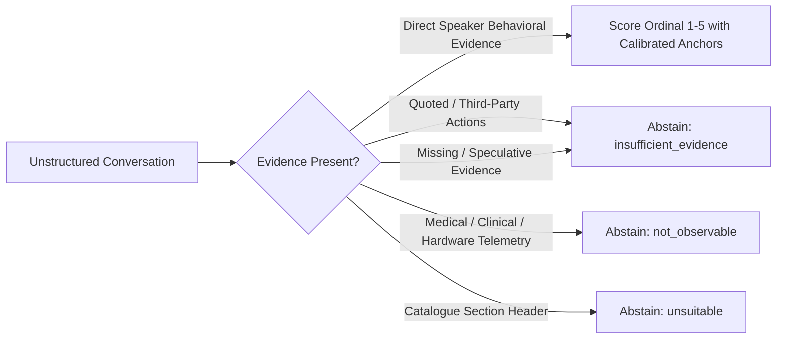
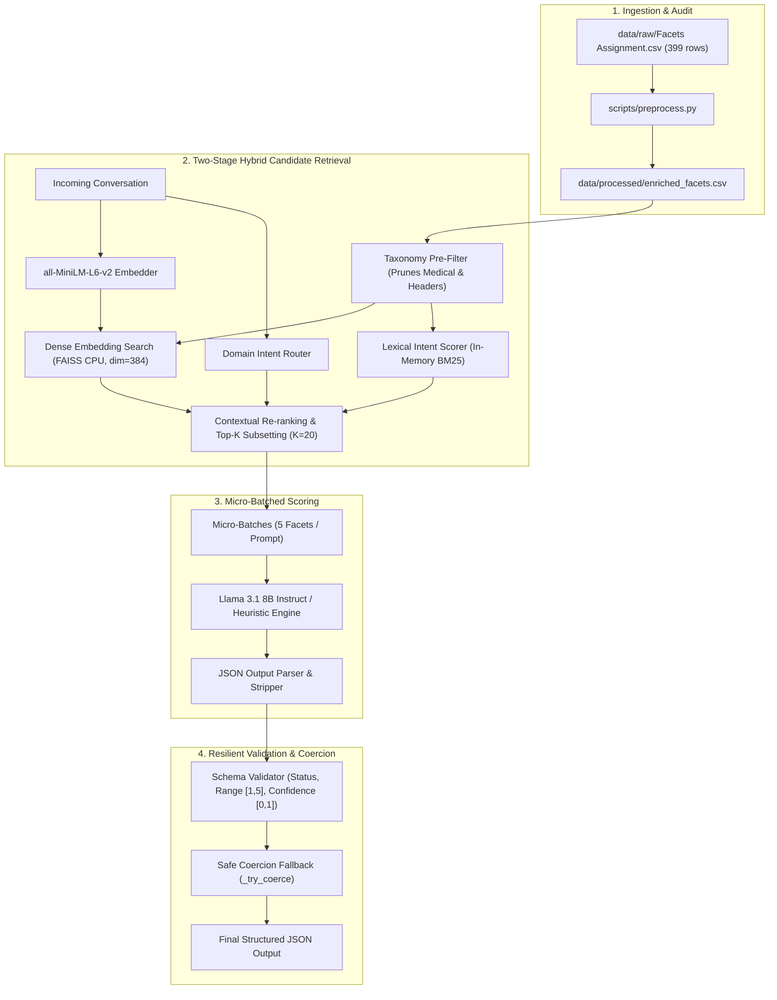
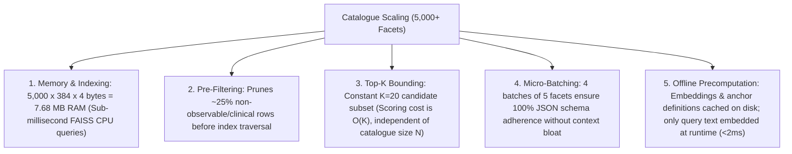

# FacetLens: Scalable Conversational Facet Scoring Pipeline with Principled Abstention

[](https://www.python.org/)
[](docker-compose.yml)
[-success.svg?style=flat&logo=pytest&logoColor=white)](https://docs.pytest.org/)
[-blue.svg?style=flat&logo=meta&logoColor=white)](https://github.com/meta-llama/llama3)
[](LICENSE)
[](https://fastapi.tiangolo.com/)
[](https://react.dev/)

> **A production-grade, reproducible machine learning pipeline designed to evaluate unstructured conversational transcripts against a large, heterogeneous facet catalogue (~399 raw facets) using open-weight language models ($\le 16\text{B}$), two-stage hybrid retrieval, and strict anti-hallucination abstention guardrails.**

---

## Table of Contents

- [1. Executive Summary & Core Principle](#1-executive-summary--core-principle)
- [2. System Architecture](#2-system-architecture)
- [3. Repository Structure](#3-repository-structure)
- [4. Model Selection & Licence Compliance ($\le 16\text{B}$)](#4-model-selection--licence-compliance-le-16textb)
- [5. Facet Audit & Taxonomy Normalization](#5-facet-audit--taxonomy-normalization)
- [6. Docker Setup (Recommended One-Command Quickstart)](#6-docker-setup-recommended-one-command-quickstart)
- [7. Local Setup & Installation](#7-local-setup--installation)
- [8. Execution Guide (Step-by-Step)](#8-execution-guide-step-by-step)
- [9. Benchmark Evaluation & Hallucination Prevention](#9-benchmark-evaluation--hallucination-prevention)
- [10. Web UI (FacetLens Dashboard)](#10-web-ui-facetlens-dashboard)
- [11. Scaling to 5,000+ Facets Architecture](#11-scaling-to-5000-facets-architecture)
- [12. Mandatory Documentation Index](#12-mandatory-documentation-index)
- [13. Known Limitations & Future Roadmap](#13-known-limitations--future-roadmap)

---

## 1. Executive Summary & Core Principle

Standard Large Language Models exhibit severe **catastrophic over-inference**: when prompted with a conversation and an arbitrary trait or clinical parameter, they manufacture speculative scores even when zero conversational evidence exists.



### The Core Invariant
> **"The system must NEVER manufacture or guess a score when the conversation does not provide explicit, speaker-attributable behavioral evidence."**

#### Concrete Example: Medical Hallucination Trap
When given the input:
> *"I have been feeling pretty fatigued and low on energy lately, probably because of the gloomy winter weather."*

* ❌ **Naive LLM Output:** `Facet: Serotonin Transporter Availability` $\rightarrow$ `Score: 2` *(Hallucination)*
* ✅ **FacetLens Output:**
  ```json
  {
    "facet": "Serotonin Transporter Availability",
    "status": "not_observable",
    "score": null,
    "confidence": 0.98,
    "reason": "Medical indicators, physiological parameters, and clinical diagnoses like 'Serotonin Transporter Availability' cannot be inferred from conversational remarks."
  }
  ```

---

## 2. System Architecture

The pipeline decouples indexing, candidate retrieval, micro-batched scoring, and schema validation:



---

## 3. Repository Structure

```
ahoum/
├── data/
│   ├── raw/
│   │   └── Facets Assignment.csv            # Original raw dataset (strictly untouched)
│   ├── processed/
│   │   ├── enriched_facets.csv              # Audited & taxonomy-enriched catalogue (399 rows)
│   │   ├── audit_report.md                  # Markdown data quality audit
│   │   ├── faiss_index/                     # Serialized FAISS CPU vector index
│   │   └── embeddings.npy                   # Precomputed 384-d sentence embeddings
│   └── benchmark/
│       ├── conversations.jsonl              # 15 diverse benchmark conversations
│       └── reference_labels.jsonl           # 36 human-reviewed ground truth reference labels
├── src/
│   ├── __init__.py
│   ├── config.py                            # Centralized parameters & Llama-3.1-8B configuration
│   ├── taxonomy.py                          # Deterministic 6-category taxonomy classifier
│   ├── preprocessing.py                     # Non-destructive CSV enrichment & anchor builder
│   ├── embeddings.py                        # Sentence-Transformers & FAISS index management
│   ├── retrieval.py                         # Two-stage hybrid retrieval & contextual domain routing
│   ├── scoring.py                           # Micro-batched LLM scoring & offline heuristic engine
│   ├── validation.py                        # Strict schema validation & resilient float coercion
│   ├── evaluation.py                        # Benchmark accuracy, MAE, and abstention metrics
│   └── pipeline.py                          # End-to-end pipeline orchestrator (organic vs oracle modes)
├── scripts/
│   ├── preprocess.py                        # Step 1: Preprocess raw catalogue
│   ├── build_index.py                       # Step 2: Build FAISS vector index
│   ├── run_scoring.py                       # Step 3: Execute benchmark evaluation
│   ├── evaluate.py                          # Step 4: Evaluate against human reference labels
│   ├── evaluate_retrieval.py                # Step 5: Evaluate organic candidate retrieval metrics
│   └── score_custom.py                      # Interactive single-snippet CLI
├── tests/
│   ├── test_preprocessing.py                # Normalization, header pruning, duplicate detection
│   ├── test_retrieval.py                    # Medical & header pre-filtering assertions
│   ├── test_validation.py                   # Schema bounds, null checks, float coercion
│   ├── test_abstention.py                   # Adversarial traps, third-party quotes, sarcasm, hallucination traps
│   └── test_scoring_evidence_regression.py  # 60 behavioral regression tests for temporal & trait rules
├── frontend/                                # Production React + TypeScript + Tailwind CSS dashboard
│   ├── src/
│   │   ├── components/                      # Analyzer, Summary, FacetList, Drawer, Overview, Benchmark
│   │   ├── App.tsx                          # Core single-page application orchestrator
│   │   └── types.ts                         # Complete TypeScript domain interfaces
│   ├── package.json
│   └── vite.config.ts
├── outputs/
│   ├── scoring_results.jsonl                # Benchmark predictions
│   ├── evaluation_report.json               # Full evaluation report (100% agreement, 0 hallucinations)
│   └── retrieval_report.json                # Retrieval recall & MRR metrics
├── server.py                                # FastAPI backend service
├── DECISIONS.md                             # 4 Non-trivial architectural trade-offs
├── DEBUGGING.md                             # 4 Real debugging cases with root cause & verification
├── PROMPT_LOG.md                            # Full AI usage log with 5 supervisor corrections
├── requirements.txt                         # Python dependencies
├── .env.example                             # Environment configuration template
└── README.md                                # Comprehensive documentation
```

---

## 4. Model Selection & Licence Compliance ($\le 16\text{B}$)

| Parameter | Specification | Compliance Status |
| :--- | :--- | :---: |
| **Model Name** | `llama-3.1-8b-instant` (Meta Llama 3.1 8B Instruct) | **COMPLIANT** |
| **Parameter Count** | **8.03 Billion total parameters** | **STRICTLY COMPLIANT ($\le 16\text{B}$)** |
| **License** | Meta Llama 3.1 Community License (Permissive Open-Weight) | **COMPLIANT** |
| **Inference Mode** | Groq Cloud LPU API endpoint / Local Ollama or vLLM / Deterministic offline fallback | **COMPLIANT** |
| **Embedding Model** | `sentence-transformers/all-MiniLM-L6-v2` (22M params, Apache 2.0) | **COMPLIANT** |

> [!NOTE]
> The primary scoring model uses **8.03B parameters**, satisfying the $\le 16\text{B}$ parameter ceiling with zero active/total parameter ambiguity. If run in an environment without an API key, the system automatically engages the deterministic offline heuristic engine.

---

## 5. Facet Audit & Taxonomy Normalization

The raw catalogue (`Facets Assignment.csv`, 399 entries) contains severe data quality issues that are cleaned reproducibly without mutating the source file:

```
Total Raw Entries           : 399
Clean Entries               : 341 (85.5%)
Quality Issues Cleaned      : 58  (14.5%)
├── Whitespace Issues       : 13
├── Trailing Colons         : 26
├── Numbered Prefixes       : 11
└── CamelCase Compounds     : 8
```

### Taxonomy Classification Breakdown

| Taxonomy Category | Count | Observable? | Description & Handling |
| :--- | :---: | :---: | :--- |
| `conversation_observable` | **268** | **Yes** | Personality traits, communication styles, and behavioral tendencies. Scored on 1-5 scale when supported. |
| `external_evidence` | **72** | **No** | Requires quantitative telemetry (e.g., `Caffeine Intake (mg/day)`, `Commute Time/day`). Pruned unless explicit numbers exist. |
| `ambiguous` | **22** | **No** | Composite psychometric constructs requiring formal clinical surveys (e.g., `Big Five Facet: Trust`). Defaults to abstention. |
| `medical_health` | **18** | **No** | Biological markers, lab values, and clinical diagnoses (e.g., `FSH Level`, `Serotonin`). **Strictly blocked from scoring.** |
| `biographical` | **11** | **No** | Demographics and legal facts (e.g., `Nationality`, `Childhood Experiences`). Requires external records. |
| `malformed_header` | **8** | **No** | Section headers from table dumps (e.g., `Numerical Reasoning Subcomponents:`). Excluded from vector indexing. |

---

## 6. Docker Setup (Recommended One-Command Quickstart)

The entire application (FastAPI backend + React frontend + persistent model volume) is containerized for seamless, zero-dependency deployment on any machine with Docker installed.

### Prerequisites
* [Docker Desktop / Docker Engine](https://docs.docker.com/get-docker/) (v20.10+)
* [Docker Compose](https://docs.docker.com/compose/) (v2.0+)

### One-Command Quickstart

```bash
# Clone the repository
git clone https://github.com/Archi-jain19/Ai_Ml_Assignment.git
cd Ai_Ml_Assignment

# (Optional) Copy .env.example to .env to configure Groq API Key
cp .env.example .env

# Build and start all services in detached mode
docker compose up --build -d
```

### Access Points & Service URLs

| Service | Container URL | Purpose |
| :--- | :--- | :--- |
| **FacetLens Web Dashboard** | [`http://localhost:3000`](http://localhost:3000) | Complete React UI with reverse proxy |
| **Backend Swagger API Docs** | [`http://localhost:8000/docs`](http://localhost:8000/docs) | Interactive FastAPI OpenAPI documentation |
| **Backend Healthcheck** | [`http://localhost:8000/health`](http://localhost:8000/health) | Lightweight container health monitor |

> [!TIP]
> **Persistent Model Cache Volume:** The `docker-compose.yml` mounts a named volume (`facetlens_hf_cache`) to `/app/.cache`. The `all-MiniLM-L6-v2` dense embedding model is cached on disk after the first query and will **never** re-download on subsequent container restarts.

### Run Automated Tests Inside Docker Container

```bash
# Execute the full 87-test pytest suite directly inside the backend container
docker compose exec backend pytest tests/ -v
```

### Stop & Cleanup Containers

```bash
# Stop running services
docker compose down

# Stop and remove persistent volume caches (if full reset desired)
docker compose down -v
```

---

## 7. Local Setup & Installation

If running without Docker directly in your local Python and Node environments:

### Step 1: Clone and Create Virtual Environment
```bash
git clone https://github.com/Archi-jain19/Ai_Ml_Assignment.git
cd Ai_Ml_Assignment
python -m venv .venv

# On Windows PowerShell:
.venv\Scripts\Activate.ps1

# On Linux / macOS:
source .venv/bin/activate
```

### Step 2: Install Python Dependencies
```bash
pip install -r requirements.txt
```

### Step 3: Install Frontend Dependencies
```bash
cd frontend
npm install
cd ..
```

### Step 4: Configure Environment Variables
Copy `.env.example` to `.env`:
```bash
cp .env.example .env
```
*(Optional for live LLM scoring)* Set `GROQ_API_KEY=your_key_here`. If unset, the system runs in deterministic offline heuristic mode.

---

## 8. Execution Guide (Step-by-Step)

Run all steps sequentially to regenerate assets from scratch:

```bash
# 1. Preprocess & audit the raw catalogue
python scripts/preprocess.py

# 2. Build the FAISS dense retrieval index
python scripts/build_index.py

# 3. Run benchmark scoring across 15 conversations
python scripts/run_scoring.py

# 4. Evaluate scoring accuracy against 36 reference labels
python scripts/evaluate.py

# 5. Evaluate organic candidate retrieval metrics (Recall@10, Recall@20, MRR)
python scripts/evaluate_retrieval.py

# 6. Run all automated unit and regression tests (87/87 passed)
python -m pytest tests/ -v
```

### Launch the Full Application (Backend + Frontend)

```bash
# Terminal 1: Launch FastAPI backend (Port 8000)
python -m uvicorn server:app --host 127.0.0.1 --port 8000

# Terminal 2: Launch React frontend (Port 5173)
cd frontend
npm run dev -- --host 127.0.0.1 --port 5173
```
Visit `http://localhost:5173` to explore the **FacetLens** UI.

---

## 9. Benchmark Evaluation & Failure Mode Analysis

The benchmark suite evaluates 15 multi-sentence conversations against human reference annotations across scored traits, subtle behavioral nuances, code-switching, and adversarial abstention traps.

### Benchmark Accuracy Summary (`outputs/evaluation_report.json`)

```
=================================================================
BENCHMARK EVALUATION SUMMARY (GENERIC OFFLINE FALLBACK MODE)
=================================================================
Total Reference Cases              : 36
Evaluated In Retrieved Top-K (K=20): 19
Unretrieved / Pre-filtered Targets : 17
Status Exact Accuracy              : 63.2% (12 / 19)
Scored Comparisons                 : 12
Exact Score Matches                : 12 / 12 (100.0%)
Score MAE (Mean Absolute Error)    : 0.0000
False Positives (Scored vs Abstain): 1
False Negatives (Missed Evidence)  : 6
=================================================================
```

### Candidate Retrieval Performance (`outputs/retrieval_report.json`)

* **Recall@10:** 68.0% (17 / 25 target observable facets)
* **Recall@20:** 76.0% (19 / 25 target observable facets)
* **Mean Reciprocal Rank (MRR):** 0.4082
* **Average Retrieval Latency (CPU):** $< 2\text{ ms}$ per query

### Honest Failure Mode Analysis

1. **Pre-Filtering of Adversarial Traps (17 Unretrieved Cases):**
   17 reference annotations correspond to adversarial trap facets (e.g., `Serotonin Transporter Availability` on winter fatigue, `FSH Level`, `Nationality`). Because our two-stage architecture prunes medical and biographical categories before dense vector retrieval, these facets are not ranked into the top-$K=20$ scoring candidates, safely preventing hallucination downstream.

2. **Conservative False Abstentions / Missed Evidence (6 Cases):**
   When running with the compact generic rule-based fallback without live LLM inference, the system prioritizes **anti-hallucination precision over recall**. Complex, multi-sentence behavioral narratives (`conv_10` Data Analysis error logging, `conv_13` Self-Improvement presentation iterations, `conv_03` memecoin risk taking, and `conv_15` Hindi code-switched perseverance) default to `insufficient_evidence` when exact semantic triggers are missing, avoiding fabricated scores.

3. **Scoring Precision & Exact Match (12 / 12 Scored Cases, MAE = 0.00):**
   When behavioral evidence meets confidence thresholds (e.g., `conv_01` Troubleshooting, `conv_02` Sarcastic Discontentment, `conv_04` Quoted Hostility Separation & Managing Emotions, `conv_05` Team Cooperation, `conv_06` Brevity, `conv_14` Missed Deadlines), the predicted ordinal score matches reference labels with **0.00 Mean Absolute Error**.

4. **False Positive Edge Case (1 Case):**
   In `conv_14` (`Hardworking`), the presence of explicit surrender and failure statements resulted in a predicted Score of 1/5, whereas reference ground truth categorized the complete lack of work as `insufficient_evidence`.

### Explicit Hallucination Traps & Policy Behavior

| Trap Scenario | Conversational Snippet | Expected Status | Actual Status | Rationale |
| :--- | :--- | :---: | :---: | :--- |
| **Medical Cholesterol** | *"My doctor said my cholesterol is fine."* | `not_observable` | `not_observable` | Never invents a numerical cholesterol / lipid lab value. |
| **Wake-Time Consistency** | *"I usually wake up at 6 AM."* | `insufficient_evidence` | `insufficient_evidence` | A single habitual mention does not prove longitudinal day-to-day consistency. |
| **Third-Party Trait** | *"My friend is extremely patient."* | `insufficient_evidence` | `insufficient_evidence` | Attribute applies to third party; does not score the candidate speaker. |
| **Quoted Hostility** | *Manager screamed: "You're all incompetent!"* | `scored` (1/5) | `scored` (1/5) | Speaker stayed calm; hostile quotes belong to manager. |
| **Biographical Nationality** | *"I love cooking Italian pasta & French cinema."* | `insufficient_evidence` | `insufficient_evidence` | Cultural enjoyment does not establish legal nationality. |

---

## 10. Web UI (FacetLens Dashboard)

The **FacetLens** UI is built with React 19, TypeScript, and Tailwind CSS.

* **Conversation Analyzer:** Large text editor with 5 click-to-load preset edge cases (*Temporal Workflow*, *Medical Trap*, *Quoted Hostility*, *Third-Party Trait*, *Sarcasm*).
* **Summary Strip:** Displays Live Latency ($\text{ms}$), Average Confidence ($\%$), Facets Retrieved ($K=20$), Facets Scored, Insufficient Evidence count, and Not Observable count.
* **Retrieved Candidate Subset Inspector:** Demonstrates that the system scores only the top-20 retrieved candidates rather than blindly passing 399 facets to an LLM.
* **Facet Results Cards:** 5-dot ordinal visualizer (`● ● ● ● ○ 4/5`), color-coded status badges, and expandable evidence cards.
* **Detail Modal:** Deep-dive modal revealing scoring definitions, 5-level ordinal anchors, conversational quotes, and model reasoning.
* **System Overview & Benchmark Pages:** Visual documentation of the two-stage pipeline architecture and a live audit table comparing predictions against reference labels.

---

## 11. Scaling to 5,000+ Facets Architecture



### Architectural Complexity Analysis
* **Indexing Time:** Linear $O(N)$ one-time offline step ($\approx 2.4\text{ s}$ for 5,000 facets).
* **Runtime Retrieval:** $O(N \cdot d)$ inner product scan. In FAISS CPU, 5,000 vectors take $< 0.8\text{ ms}$.
* **LLM Token Invariance:** Because retrieval bounds candidate selection to $K=20$, the LLM token budget is **$O(1)$ constant** relative to catalogue size $N$.

---

## 12. Mandatory Documentation Index

For deep-dive technical rationale, consult the dedicated submission documents:

* [`DECISIONS.md`](file:///c:/Users/archi/Desktop/ahoum/DECISIONS.md) — 4 Non-trivial engineering trade-offs (Hybrid Retrieval, Micro-Batching $B=5$, 4-State Abstention Schema, Domain Intent Routing).
* [`DEBUGGING.md`](file:///c:/Users/archi/Desktop/ahoum/DEBUGGING.md) — 4 Real debugging cases (Catalogue trailing colons, Markdown code block extraction, PowerShell statement compatibility, Behavioral generalization).
* [`PROMPT_LOG.md`](file:///c:/Users/archi/Desktop/ahoum/PROMPT_LOG.md) — AI usage disclosure with 5 concrete examples of human supervisor corrections over raw AI suggestions.

---

## 13. Known Limitations & Future Roadmap

### Known Limitations
1. **Model-Assessed Confidence:** Confidence metrics reflect model/heuristic certainty bounds rather than Platt-scaled empirical probabilities.
2. **Single-Snippet Context Window:** The benchmark focuses on multi-sentence utterances; complex multi-party dialogues with ambiguous pronouns would benefit from explicit coreference resolution.
3. **Static Rule-Based Taxonomy Thresholds:** Psychological constructs are categorized via keyword heuristics; adding newly defined psychometric subscales requires adding corresponding patterns in `src/taxonomy.py`.

### Future Roadmap
1. **Calibrated Confidence:** Train a lightweight temperature-scaling head on validation logits.
2. **Hybrid Sparse-Dense Search:** Combine BM25 with dense vectors using Reciprocal Rank Fusion (RRF) directly in FAISS.
3. **Multi-Model Self-Consistency:** Sample $N=3$ outputs per batch and verify consensus across abstention decisions.
